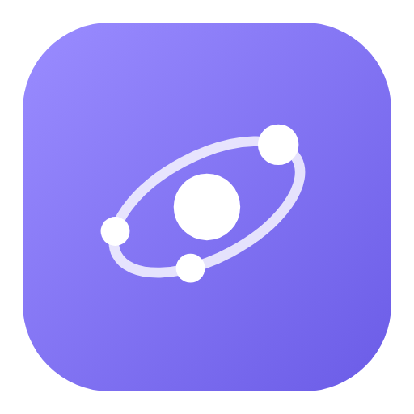

<p align="center"></p>

<h1 align="center">Orbit</h1>

<p align="center">Your personal team of AI employees, running on your own computer, on Claude, ChatGPT or Gemini.</p>

Orbit lets you hire a small team of AI employees, each with a name, a job, a personality and their own rules, and work with them the way you would with real people. Chat with anyone, hand out tasks, and let your main assistant split big jobs across the team. Everything runs on your machine, on your own login with Claude Code, ChatGPT (Codex) or Gemini (Antigravity).

It works on **macOS, Windows and Linux**.

## What you can do

- **Hire a team.** Give each person a title, a job description, a personality, a boss and their own profile picture. Or use **Hire with help**: a hiring assistant asks you a few rounds of questions, proposes people, and hires the ones you pick. A new Orbit starts this way.
- **Profile pictures, drawn for you.** Each new hire gets a picture drawn from their job and personality, in a style you choose (pixel art, anime, cartoon and more). Redraw it any time.
- **Chat or hand out tasks.** Talk to anyone directly, or put work on the board. They can create tasks for each other and report back when they're done.
- **Watch it live.** The **Live** page shows every chat and task that's running right now. While someone is working, **Interrupt** (⌘↩) stops them and sends your new message straight away.
- **Stay in control.** You choose what each person may touch on your computer. Anything risky asks you first, in a popup.
- **Answer quickly.** When someone needs a decision, the chat box turns into a short multiple-choice form.
- **Give them skills.** Make your own, import a SKILL.md, add skills from a GitHub link, or hand out the skills you already have in Claude Code. **Assign automatically** reads everyone's job and suggests who gets what, for you to approve. Each reply shows the skills it used.
- **Orbit's core skills.** Everyone follows the same ways of working: hand work to the best person, start with the lightest model that fits and move up only when needed, check results, never pass work back and forth in loops, and search the skill collection before starting.
- **Auto picks the model.** Everyone starts on Auto: for each chat or task, Orbit picks the lightest model that will do it well. You can pick a model for anyone, or for any chat.
- **Claude, ChatGPT or Gemini.** Your team can run on any of them: one is the main AI, and in Settings → Connectors you can switch on the others (and Grok, with your xAI API key). Then anyone can run on them, or Auto can pick them when they fit best.
- **Work in projects.** Each project has a folder and a shared memory the team keeps up to date.
- **Attach files.** Upload files, or point at files in the project with `@`.
- **From your phone.** Open the whole of Orbit from anywhere through a web link with a password (a free Cloudflare link, or your own domain), or chat with your team from **Telegram** or **WhatsApp**: requests for your OK, questions and finished work come with buttons.
- **Share a teammate.** Export one person, or your whole team, as a file with their skills, and give it to a friend. Importing never overwrites anyone: a clashing name gets a number.
- **Make it yours.** Themes, accent colours, backgrounds and any Google Font. Install it as an app with its own window.

## What you need

- **Node.js 24 or newer**: [nodejs.org](https://nodejs.org)
- **One AI, signed in:** [Claude Code](https://claude.com/claude-code) (Claude), the [Codex CLI](https://developers.openai.com/codex/cli) (ChatGPT) or the Antigravity CLI (Gemini). Your team runs on your own plan with that company. The installer asks which should run your team if you have more than one; you can switch on the others, or Grok with an xAI API key, later.
- **Windows, with Claude Code:** Git for Windows ([git-scm.com](https://git-scm.com/download/win)), which Claude Code uses to run commands.

## Install

Download Orbit (Code → Download ZIP, or `git clone https://github.com/MohanViswagnaMR/Orbit.git`), then:

| System | Do this |
|---|---|
| **macOS** | Double-click `install/Install Orbit (Mac).command`, or run `bash install/install.sh` |
| **Windows** | Double-click `install\install-windows.cmd` |
| **Linux** | Run `bash install/install.sh` |

The installer:
- checks what you need: Node.js, and at least one of Claude Code, the Codex CLI or the Antigravity CLI;
- copies Orbit to its own folder;
- finds your data if you've used Orbit before, and asks whether to keep it or start fresh. You can also drag in a backup file to restore;
- for a new team, asks which AI should run it, if it finds more than one;
- makes Orbit start by itself when you log in, then opens it at **http://localhost:4321**.

**New to this?** The [setup guide](docs/SETUP.md) walks through every step, including installing Node.js and an AI.

## First steps

1. **Hire your first teammate.** A new Orbit opens with **Hire with help**, or set someone up yourself. Your first hire becomes your **main assistant**: you talk to them first, and they run the team for you.
2. **Settings → General:** tell your team what to call you.
3. **Start a chat** on the home page.
4. **Optional, Settings → Connectors:** switch on the other AIs you have, or change which one is your main AI.

## Your data, backups and reinstalling

Everything Orbit knows is kept in one data folder, apart from the app:
- your team, and each person's preferences, rules, notes and picture;
- your profile and settings;
- chats, tasks, projects and their memory;
- uploads and skills.

Updating or removing the app never touches it.

- **Back up any time:** Settings → General → **Download a backup** saves it as one file. Tick what goes in.
- **Update:** download the new version and run the installer again. When it finds your data, choose **Use it**.
- **Remove:** run `bash install/uninstall.sh` (macOS, Linux) or double-click `install\uninstall-windows.cmd` (Windows). It asks what to do with your data:
  - keep it where it is;
  - save a backup file, then remove it;
  - delete it.

  It also removes the tool connection Orbit added to Antigravity, if you used Gemini.
- **Reinstall, or move to another computer:** run the installer. If your data is still there, it asks **use it, or start completely fresh**; starting fresh moves the old data aside and never deletes it. If you have a backup file, drag it into the installer window when it asks.

## Where your things are

Orbit keeps the app and your data in separate folders, so updating never touches your data.

| | macOS | Windows | Linux |
|---|---|---|---|
| The app | `~/Applications/Orbit` | `%LOCALAPPDATA%\Orbit` | `~/.local/share/orbit` |
| Your data (team, chats, files) | `~/.orbit` | `%USERPROFILE%\.orbit` | `~/.orbit` |
| The log | `~/.orbit/server.log` | `%USERPROFILE%\.orbit\server.log` | `~/.orbit/server.log` |
| Backups from the uninstaller | your home folder | your user folder | your home folder |

## Privacy and safety

- **Only on your computer.** Orbit listens on `127.0.0.1`, so other computers on your network can't reach it, unless you switch the web link on (below).
- **Only your account.** Orbit's data folder can only be opened by your own account on the computer, and backup files likewise. If other people have accounts on your computer, turn on **Password on this Mac too** (Settings → Phone → Web link) so they can't use Orbit without your password.
- **Your own logins.** Your employees use the logins already on your computer: Claude Code, Codex (ChatGPT) or Antigravity (Gemini). Orbit never asks for a password. The only key it stores is an xAI key for Grok, if you add one: it stays on this computer, is never shown again, and is left out of backups.
- **Antigravity.** Using Gemini adds an "orbit" tool connection to Antigravity's own settings; it only works inside Orbit's runs. Switching Gemini off, or uninstalling Orbit, removes it.
- **The web link.** Off until you switch it on. Only signed-in phones and browsers get in: a password (only its hash is kept), sign-ins that last 30 days, and a lockout after repeated wrong passwords. The password, the link and the chat apps can only be changed on the computer itself. Telegram and WhatsApp only answer the one chat you paired, and their keys are left out of backups.
- **You set the limits.** Each person can read only, edit files in their own folder, or have full access. On Claude, anything outside that asks you first. On ChatGPT and Gemini it is simply blocked, and they tell you.

## For developers

No dependencies, no build step: just Node.js built-ins.

```sh
node server.js      # start on http://localhost:4321 (PORT and ORBIT_DATA change the port and data folder)
node --test         # run the tests
```

- `server.js`: the whole backend: HTTP API, SQLite through `node:sqlite`, the MCP tools employees use, and the engines that run each turn (Claude Code, Codex, Antigravity).
- `index.html`: the whole interface.
- `backup.mjs`: backups and restores, also used by the installers.
- `mcp-bridge.mjs`: Orbit's tools for Antigravity, which only takes tool connections from its own settings.
- `skills/`: Orbit's core skills, which everyone on every team has.
